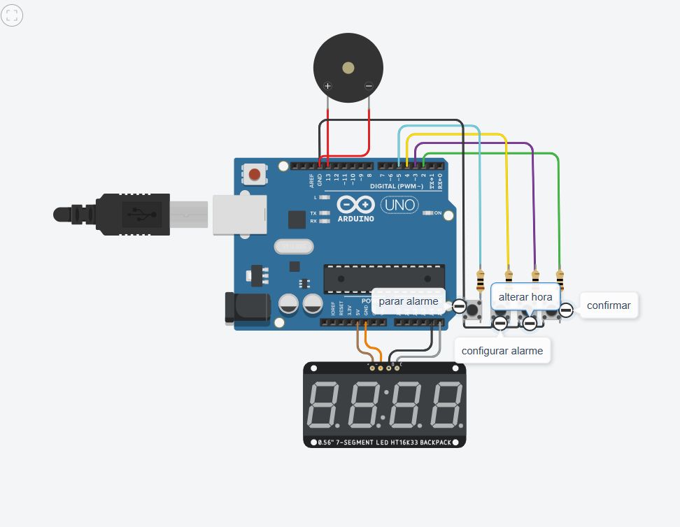

# ⏰ Relógio com Alarme usando Arduino UNO

Este projeto implementa um relógio digital com função de alarme usando um **Arduino UNO**, um **display de 7 segmentos com backpack HT16K33**, botões de controle e um buzzer piezoelétrico.

## 🧰 Componentes Utilizados

- 1x Arduino UNO  
- 1x Display 7 segmentos 4 dígitos com backpack HT16K33 (I2C)  
- 4x Botões (Confirmar, Alterar hora, Configurar alarme, Parar alarme)  
- 4x Resistores de pull-down (10kΩ)  
- 1x Buzzer piezoelétrico  
- Cabos jumper e protoboard  

## 🔌 Ligações

| Componente              | Pino no Arduino |
|-------------------------|-----------------|
| Botão Confirmar         | D2              |
| Botão Alterar Hora      | D3              |
| Botão Configurar Alarme | D4              |
| Botão Parar Alarme      | D5              |
| Buzzer                  | D13             |
| Display (I2C)           | A4 (SDA), A5 (SCL) |

> O display é conectado via protocolo I2C com o endereço padrão `0x70`.

## 📋 Funcionalidades

- Mostra a hora em formato 24h (HH:MM)
- Permite configurar horas e minutos atuais
- Permite configurar horário do alarme
- Alarme com melodia (dó a dó) quando a hora do alarme for atingida
- Parada manual do alarme com botão dedicado

## 🎮 Modos de Operação

| Modo   | Descrição                        |
|--------|----------------------------------|
| 0      | Relógio em funcionamento         |
| 1      | Ajuste de hora                   |
| 2      | Ajuste de minuto                 |
| 3      | Ajuste de hora do alarme         |
| 4      | Ajuste de minuto do alarme       |

### Transições de Modo

- **Botão "Alterar hora"**: Entra no modo 1 e incrementa a hora.
- **Botão "Configurar alarme"**: Entra no modo 3 e incrementa a hora do alarme.
- **Botão "Confirmar"**: Avança entre os modos ou confirma alterações.
- **Botão "Parar alarme"**: Interrompe o alarme durante a execução.

## 🔊 Alarme Musical

Quando o horário programado é atingido, o alarme toca uma sequência musical com as seguintes notas:

Dó, Ré, Mi, Fá, Sol, Lá, Si, Dó
Frequências: 262, 294, 330, 349, 392, 440, 494, 523 Hz

A sequência é tocada 3 vezes ou até que o botão "Parar alarme" seja pressionado.

## 📦 Bibliotecas Necessárias

Instale via Library Manager da Arduino IDE:

- `Adafruit GFX`
- `Adafruit LED Backpack`
- `Wire` (já incluída por padrão)

## 🚀 Como Usar

1. Monte o circuito conforme o esquema da imagem `relogio.png`.
2. Faça o upload do código para o Arduino UNO.
3. O display iniciará em 12:00.
4. Use os botões para configurar o relógio e o alarme.

## 📷 Esquema de Montagem

A imagem `relogio.png` mostra como os componentes devem ser conectados. Inclua essa imagem no repositório para visualização no GitHub.

---

💡 Projeto ideal para fins didáticos e práticas com controle de tempo, uso de I2C e interações básicas com botões.
